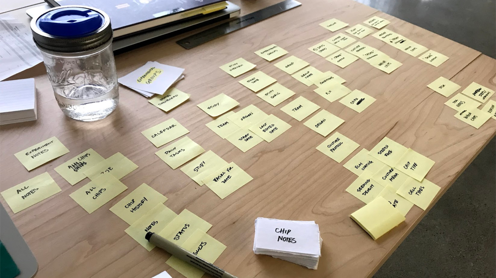

### Open-Ended Discovery Research

My initial task was to broadly map and understand the workflows of biologists working with the Organs-on-Chips technology. This was a very undirected phase of research, with the ultimate goal of identifying possible areas-of-opportunity or intervention points for improvements. 

#### User Research

I spent a lot of time in the biology lab, talking with biologists, observing their process.

While conducting this research, I was constantly synthesizing everything I was learning, creating maps, process diagrams and journey maps and workflows. The synthesized material both served as notes, as well as frameworks that I would use in the future to map pain-points and opportunity points. 

Part of my process involved relationship building. I wanted to make sure that I wasn't just taking up the biologists time, so I would volunteer to help with some of the more tedious lab tasks as a way to get time to chat with biologists. 

Some of the key insights I gathered from this user research is listed below. 

#### Understanding Business Needs

While understanding the user needs was important, at the same time, I needed to understand what the business needs and vision was. One way I got this information was through a "software workshop" that included the CTO. During this workshop, we brainstormed different ideas for pieces of software the company could develop. 

I mapped these ideas onto the workflow diagrams I had generated from the user research. Two of the key things I learned during activities like this were:
* The company was very interested in big data and machine learning, but wasn't positioned yet to move in that direction
* The team had no way of collecting standardized biology data from the scientists, making it hard to evaluate the performance of the product. 

### Identifying an Area of Opportunity

As I synthesized both the user needs and business needs, I realized that there was some overlap around data management. I started to map out all the types of data that could be collected, both from biologists and from the product itself. 

From here, I developed a high-level proposal with my boss for an app ecosystem that would collect and standardize experiment data while also providing biologists with scheduling, planning, and analysis tools that would make their lives easier. 

The next step was to convince the upper management team that this project could provide value to the company. At this initial stage, it was challenging to get upper management to trust our design research findings because they contradicted some of the "best practices" for doing science. But we eventually got enough buy-in to start to build out the vision. 

### Initial Wireframes

Our initial wireframes focused on the main component of this app ecosystem, called the "Study Manager." We put together an intitial product statement for the app, and then started creating rough sketches that we could bring to informal conversations with biologists. 

## Informal Interviews & Conversations *(6x 45min sessions)*

These informal conversations helped us to quickly refine our paper prototype screens, quickly iterating through ideas. 

### Works-Like Prototype

The goal of this next phase of work was to build a working prototype that could be tested live within our internal labs.

The prototype we developed was made with a Framer frontend and a Firebase backend. I contributed a few elements of the Framer frontend, but it was mainly built by two other members of the team. My role was to continue to conduct research on existing methods of study planning and execution, and to iterate on static designs of the necessary components.

<iframe style="border: 1px solid rgba(0, 0, 0, 0.1)" width="800" height="450" src="https://www.figma.com/embed?embed_host=share&url=https%3A%2F%2Fwww.figma.com%2Ffile%2FdBFpNHhGJMpFvg2WnKP7yU%2Ftimeline-flows%3Fnode-id%3D0%253A1" allowfullscreen></iframe>

After a summer of building the prototype, we showed the prototype to seven people in one hour UX testing sessions. During each of these sessions, we prompted users to try to achieve certain tasks without our help. 

## Scripted UX Tests *(7x 60min sessions)*

Based on these UX tests, we found that the system architecture wasn’t working well. Upon further reflection, we realized more time could have been spent on paper prototypes before creating a works-like prototype. We jumped into prototyping too soon.

~~**Outcomes:**~~ From this phase of work, the output was a slide deck for upper management, sharing our findings, and showing our vision for the project long term. The prototype was only the tip of the iceberg for an envisioned app ecosystem.

### Defining Long Term Product Vision

Beyond the single application that we had been prototyping, I also needed to communicate the long-term product vision, which involved an ecosystem of appplications. The goal of this work was to communicate the vision to upper management, and show the value all the applications could bring when they were all integrated. 

In addition, we needed everyone of the team to be aligned on the product vision, so that any decisions made while working on the Study Manager would still enable the future capabilities of the ecosystem. 

This visualization shows the high level capabilities, and how they map out to different phases of biologists' work. The detailed diagrams below highlight how each of the capabilities interrelate and would share data. In addition, they highlight the needs that the ecosystem would fulfill for each of the user types we had identified. 

#### Workflows

I also started to think at a high-level about the workflows that biologists were going though and how we could support them as their goals changed, through the lifecycle of an experiment. 

We needed to communicate what it would "feel" like to use this ecosystem. How would it transform a biologists' life? Storyboards helped to communicate this, showing how our ecosystem of apps would support biologist through the end-to-end process.

#### Imagining Future Interactions

While the Study Manager was using conventional web technologies, as a part of the vision-ing work, I also created mockups of future interactions the company could develop ontop of the ecosystem, using AR to train people on the technique for using the Organs-on-Chips technology, or using voice assistants to read out protocol steps in the lab. 

### Refining UX and Information Architecture

Following the failure of the working prototype, we took a step back to refine the system and information architecture before restarting work on functional prototypes. I did this by taking real data and more biologists’ workflow, and trying to fit it into the proposed software architecture.

It also involved collecting a variety of existing studies from powerpoint presentations, word documents, lab notebooks, and other sources, looking to see whether they mapped properly into the design.

Throughout this process, I continued the research, trying to wrangle the complex topics and standardize the process to a point where they could fit into the application. Some of the outputs from this research was more process diagrams or information heirarchies.

#### Testing Mental Models

To test the new system architecture, instead of making a prototype, I made a cardsorting activity that users could work with to test the system. The goal of this activity was to see if there was any format of information typically a part of the study that didn’t have a place within the app. It simulatenously served to test my definitions.

## Informal Cardsorting *(3x 30min sessions)*

Once the architecture was validated through the cardsorting activity, I built an InVision walkthrough of the whole application. The screen were later styled by a UI designer to fit within the new software style guide being developed. 

### Final Designs

~~**Outcomes:**~~ The final output was a series of slide decks that were also UX walkthroughs of each page of the application. There were also slides that defined terminology, as well as where future applications could connect. The project was approved by upper management to be sent out to external developers to be prototyped.

